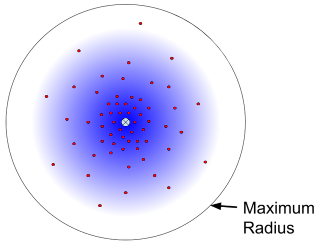

.. _observations:

============
Observations
============

Ichnaea builds its database of Bluetooth, WiFi, and Cell stations based on
observations of those stations.

.. contents::
   :local:

The theoretical model is that a station radiates in a circle, so that
observations are equally likely in any direction. Observations are more likely
closer to the station, and will have a higher signal strength the closer they
are. The station position can then be estimated by taking the average position
of the observations, and further observations will result in a more accurate
estimate of the station position.

.. Source embeded in document:
.. https://docs.google.com/document/d/13KWfVTNTM5_XgNLZkTwLWlvl8a9pYbm3RVwb5PW76hg

          and a maximum radius, along with a random sample of observations.
    :figclass: align-center

    The theoretical model of a station and observations

Radio observations are more complicated than the model. Most stations do not
radiate equally in all directions, and signal strength is not always correlated
with distance from the station. Some stations are mobile, such as WiFi on a
commuter train. Some stations are moved, such as a WiFi access point that moves
with the owners to a new home. Additionally, the reporting device may not
acquire a high accuracy position reading, and may report stations from a cache
after the station is out of range.

The station updating algorithm combines multiple data items to mitigate
non-ideal observations. The position estimate uses a weighted average, so that
stronger observations contribute more to the position estimate than the weaker
ones, and some observations are discarded entirely. Observations are batched to
detect outliers. Positions backed by GPS are preferred over those sourced from
location queries.

Based on the confidence in the observations, the station updating algorithm can
confirm a station is active, adjust the position, block it temporarily from
location queries, or remove historic position data completely.

Sources and Batching
====================

Observations come from two sources:

Submission reports
  The device sends the detected radio stations, along with a position, which is
  usually derived from high-precision satellite data such as GPS.  These
  reports are used to determine the position of newly discovered stations, or
  to refine the position estimates of known stations.

Location queries
  The device sends the detected radio sources, and Ichnaea returns a position
  estimate or region based on known stations and the requester's IP address.
  This data is used to discover new stations, and to confirm that known
  stations are still active.

The :ref:`data flow process <position-data-flow>` creates observations by
pairing the position data with each station, and then adds the observations to
update queues based on the database sharding. Cell stations are split by radio
type, and the observations are added to queues like ``update_cell_gsm`` and
``update_cell_wcdma``.  Bluetooth and WiFi stations are split into 16 groups by
the first hexadecimal letter of the identifier, and the observations are added
to queues like ``update_wifi_0`` and ``update_blue_a``.

These per-shard queues are processed when a large enough batch is accumulated,
or when the queue is about to expire.  Batching increases the chances that
there will be several observations for a station processed in the same chunk.

Observation Weight
==================

Each observation is assigned a weight, to determine how much it should contribute
to the station position estimate, or if it should be discarded completely. The
observation weight is based on four metrics:

Accuracy
  Expected distance from the reported position to the actual position, in
  meters.

Age
  The time from when the radio was seen until the position was recorded, in
  seconds. The age can be negative for observations after the position was
  recorded.

Speed
  The speed of the device when the position was recorded, in meters per second.

Signal
  The strength of the radio signal, in dBm (decibel milliwatts).

The observation weight is the product of four weights:

  **(accuracy weight) x (age weight) x (speed weight) x (signal weight)**

The first three weights range from 0.0 to 1.0. If the accuracy radius is too
large (200m for WiFi), the age is too long ago (20 seconds), or the device is
moving too quickly (50m/s), the weight is 0.0 and the observation is discarded.
If the accuracy distance is small (10m or less), the age is very recent (2s or
less), and the device is moving slowly (5m/s or less), then the weight is 1.0.

The signal weight for cell and WiFi stations is 1.0 for the average signal
strength (-80 dBm for WiFi, -105 dBm to -95 dBm for different cell
generations), grows exponentially for stronger signals, and drops exponentially
for weaker signals. It never reaches 0.0, so signal strength does not
disqualify an observation in the same way as accuracy, age, or speed. For
bluetooth stations, the signal weight is always 1.0.

When accuracy, age, speed, or signal strength is unknown, the weight for that
factor is 1.0.

An observation weight of 0.0 disqualifies that observation. An average
observation should have a weight of 1.0. Weights are used when averaging
observation positions, and when adjusting the position of an existing station.
Existing stations store the sum of weights of previous observations, so that
new observations have a smaller influence on position over time.

For more information, see `Weight Algorithm Details`_.

Blocked Stations
================
Only stationary cell, WiFi, and Bluetooth stations should be considered when
estimating a position for a location query. Ichnaea keeps track of mobile
stations as blocked stations, and uses observations to keep them blocked or
move them back to regular stations.

When a station is blocked, it remains blocked for 48 hours. This temporary
block is used to handle a usually stationary station that is moved, such as a
WiFi access point that moves to a new location.

A station's block count is tracked, and compared to how long the station has
been tracked. If a station has been blocked more times than its age in 30-day
"months", then it is considered a mobile station and remains in a long-term
block. For example, if a station tracked for a year has been blocked 12 times
or more, it remains in a long-term block.

Observations for blocked stations are added to the daily observation count, but
are not processed to update the station. Blocked stations do not store a
position estimate, but retain a region if they once had a position estimate,
and can still be used for region queries.

Updating Stations
=================
The observations (with non-zero weights) for a station are processed as a
group, to determine how the station should be updated. If there are valid
GPS-based observations, only those are used, discarding any observations based
on location queries.

If an existing station is still blocked, then it remains blocked. For unblocked
stations, here is the decision process for determining what the "transition
state", or update type, should be:

.. Original at:
.. https://docs.google.com/drawings/d/12oo7ffQWZf5L5_Q0dnN5WBM88PVrT6pYv1V5AmFtUrA

.. image:: observations-flowchart.png
    :width: 796px
    :height: 1050px
    :scale: 75%
    :align: center
    :alt: A flowchart showing how the facts are used to determine what kind of
          update to make the the station.

Several yes-or-no facts are used to determine the update type:

* *Station Exists?* - Is there a record for this station in the database?
* *Consistent Position?* - Are multiple observations close enough that they
  could be observing the same stationary station, or are they spread out enough
  that they could be observing different stations or a moving station? The
  "close enough" radius changes based on the type of station (100m for
  Bluetooth, 5km for WiFi, and 100km for cell stations).
* *Station Has Position?* - Does the station have a position estimate in the
  database?
* *Position Agrees?* - Does the station position agree with the observations,
  or do the observations suggest the station has moved?
* *Old Position?* - Has the station's position not been confirmed for over a
  year?
* *GNSS Station?* - Is the station's position based on Global Navigation
  Satellite System data, such as GPS?
* *GNSS Position?* - Is the observation based on a GNSS position submission,
  rather than a location query?

These are used to determine a transition state:

* *No Change* - No change is made to the station
* *New* - A new station is added to the database.
* *New Block* - A new blocked station is added to the database.
* *Change* - An existing station's position is adjusted, based on the weighted
  average of the current position and the observations.
* *Confirm* - An existing station is confirmed to still be active today.
  Stations that were already confirmed today are unchanged.
* *Replace* - A station's position is replaced with the observation position
* *Block* - A station's position is removed, and it is blocked from being used
  for location queries

Related cell stations are grouped into a *cell area*. These can be used for
location queries, when a particular cell station is unknown but others in the
cell area group are known. If a cell station is created or has an updated
position (all transition states but *No Change* or *Confirm*), then the cell
area is added to a queue `update_cellarea`, and processed when enough cell
areas are accumulated.

Metrics are collected based on the update type. There is a daily count of
observations, and a count of newly tracked stations, both by radio type, stored
in Redis. There are four statsd counters as well:

* ``data.observation.insert`` - Counts all observations with a non-zero weight,
  including those observing a blocked station
* ``data.station.blocklist`` - Counts new stations that start blocked (*New
  Block*) and stations converted to blocked (*Block*)
* ``data.station.confirm`` - Counts existing stations confirmed to still be
  active (*Confirm*)
* ``data.station.new`` - Counts new stations added, either as blocked stations
  (*New Block*), or non-blocked stations (*New*)

Weight Algorithm Details
========================

The observation weight is the product of four weights:

  **(accuracy weight) x (age weight) x (speed weight) x (signal weight)**

The accuracy, age, and speed weights use the same algorithm, with these
features:

* The weight is 1.0 if the metric is small enough (at or below **MIN**), fully
  weighting the observation. If the metric is unknown, the weight is also 1.0.
* The weight is 0.0 if the metric is too large (at or above **MAX**), rejecting
  the observation.
* The weight drops logarithmically from 1.0 if the metric is between **MIN**
  and **MAX**.

.. Original from
.. https://docs.google.com/spreadsheets/d/1C_Ui3t1rl4uRfWktUVzShm3OEnw_ZaYqQeH4oVoRaO8

.. figure:: observations-qualifying-weight.png
    :width: 600px
    :height: 371px
    :align: center
    :alt: A generic chart of the qualifying weight algorithm, as described above.
    :figclass: align-center

    The weight curve for qualifying metrics

+----------+-----------------+------------+-------------+---------------------+
| Metric   | MIN, Weight=1.0 | Weight=0.5 | Weight=0.33 | MAX, Weight=0.0     |
+==========+=================+============+=============+=====================+
| Accuracy |            10 m |       40 m |        90 m | | 100 m (Bluetooth) |
|          |                 |            |             | | 200 m (WiFi)      |
|          |                 |            |             | | 1000 m (Cell)     |
+----------+-----------------+------------+-------------+---------------------+
| Age      |             2 s |        8 s |        18 s | 20 s                |
+----------+-----------------+------------+-------------+---------------------+
| Speed    |           5 m/s |     20 m/s |      45 m/s | 50 m/s              |
+----------+-----------------+------------+-------------+---------------------+

The signal weight algorithm varies by radio type. The signal weight is always
1.0 for Bluetooth. For WiFi and Cell radios, the weight is 1.0 for the average
signal, and grows exponentially as the signal gets stronger.

.. Original from
.. https://docs.google.com/spreadsheets/d/1C_Ui3t1rl4uRfWktUVzShm3OEnw_ZaYqQeH4oVoRaO8

.. figure:: observations-signal-weight.png
    :width: 600px
    :height: 371px
    :align: center
    :alt: A generic chart of the signal weight algorithm, as described above.
    :figclass: align-center

    The weight curve for signal strength

Here are the signal strengths for interesting weights:

+-------+------------+------------------+------------+------------+
| Radio | Weight=0.5 | Weight=1.0 (Avg) | Weight=2.0 | Weight=4.0 |
+=======+============+==================+============+============+
| WiFi  | -98.9 dBm  | -80 dBm          | -64.1 dBm  | -50.7 dBm  |
+-------+------------+------------------+------------+------------+
| GSM   | -113.9 dBm | -95 dBm          | -79.1 dBm  | -65.7 dBm  |
+-------+------------+------------------+------------+------------+
| WCDMA | -118.9 dBm | -100 dBm         | -84.1 dBm  | -70.7 dBm  |
+-------+------------+------------------+------------+------------+
| LTE   | -123.9 dBm | -105 dBm         | -89.1 dBm  | -75.7 dBm  |
+-------+------------+------------------+------------+------------+

If the signal strength is unknown, a signal weight of 1.0 is used.
