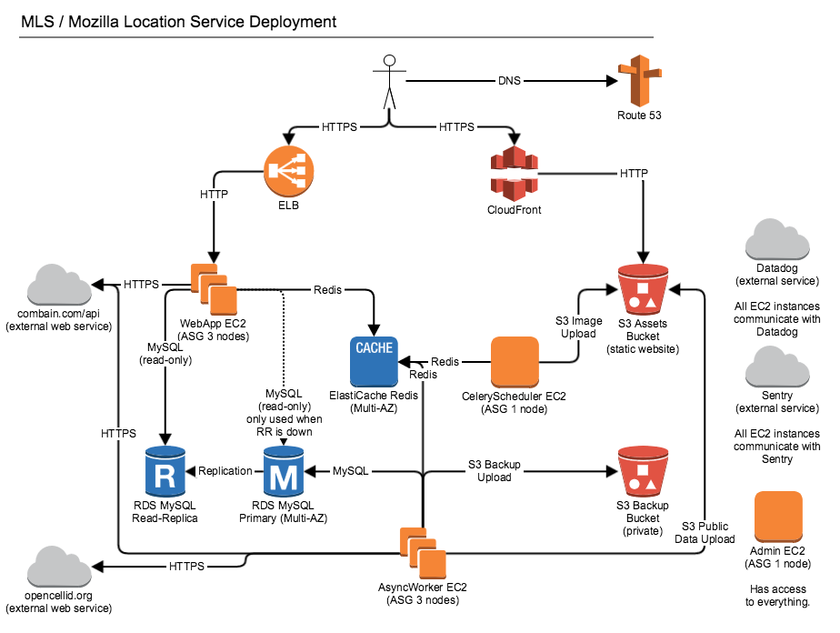

.. _deploy:

==========
Deployment
==========

We deploy ichnaea in an Amazon AWS environment, and there are some
optional dependencies on specific AWS services like Amazon S3. The
documentation assumes you are also using a AWS environment, but ichnaea
can be run in non-AWS environments as well.

Diagram
=======

A full deployment of the application in an AWS environment can include all
of the parts shown in the diagram, but various of these parts are optional:

Specifically Amazon CloudFront and S3 are only used for backup and serving
image tiles and public data downloads for the public website.
Using Combain, Datadog, OpenCellID and Sentry is also optional.
Finally there doesn't have to be a `admin` EC2 box, but it can be helpful
for debug access and running database migrations.

MySQL / Amazon RDS
==================

The application is written and tested against MySQL 5.6.x or Amazon RDS of the
same version. The default configuration works for the most part. There are
just three changes you need to do. For example via the my.cnf:

.. code-block:: ini

    [mysqld]
    innodb_file_format=Barracuda
    innodb_strict_mode=on
    sql-mode="NO_ENGINE_SUBSTITUTION,STRICT_TRANS_TABLES"

The web app frontend role only needs access to a read-only version of
the database, for example a read-replica. The async worker backend role
needs access to the read-write primary database.

Redis / Amazon ElastiCache
==========================

The application uses Redis as a queue for the asynchronous task workers and
also uses it directly as a cache and to track API key rate limitations.

You can install a standard Redis or use Amazon ElastiCache (Redis).

Amazon S3
=========

The application uses Amazon S3 for various tasks, including backup of
:term:`observations`, export of the aggregated cell table and hosting of
the data map image tiles.

All of these are triggered by asynchronous jobs and you can disable them
if you are not hosted in an AWS environment.

If you use Amazon S3 you might want to configure a lifecycle policy to
delete old export files after a couple of days and :term:`observation`
data after one year.

Datadog / Statsd / Sentry
=========================

The application uses Statsd to aggregate stats and Sentry to log
exception messages.

To use Statsd, you need to configure it in the config file, specifying
a host and port, for example localhost port 8125.

To get the app to log exceptions to Sentry, you will need to obtain the
DSN for your Sentry instance. Edit location.ini and in the `sentry` section
put your real DSN into the `dsn` setting.

Installation of Statsd and Sentry are outside the scope of this documentation.

Image Tiles
===========

The code includes functionality to render out image tiles for a data map
of places where observations have been made.

You can trigger this functionality periodically via a cron job, by
calling the application container with the map argument.
