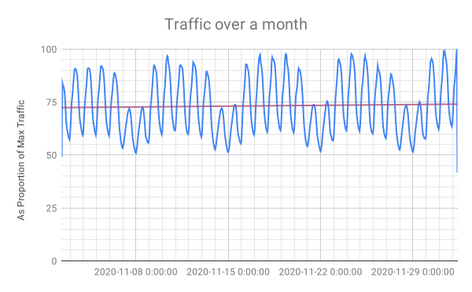
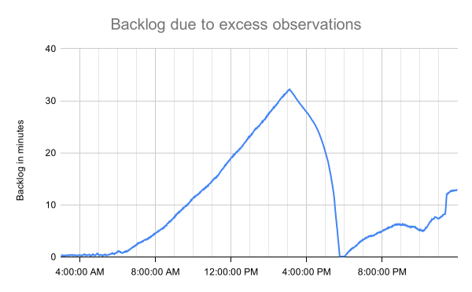
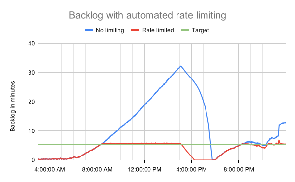
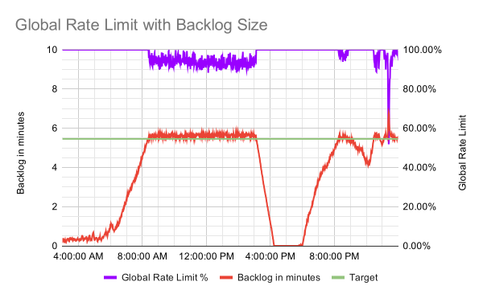

.. _rate_control:

====================================
Processing Backlogs and Rate Control
====================================

Ideally, all :term:`observations` would be used to update the Ichnaea database.
This would require backend resources (the worker servers, the cache,
and the database) that can easily handle peak traffic. Such a system will be
overprovisioned most of the time, as traffic ebbs and flows over days and weeks.
A backend that can easily handle peak traffic may be prohibitively expensive or
impractical, and require quickly adding more resources if traffic is
consistently growing. There is a complex relationship between API traffic and
observations, so it is not possible to predict the required backend resources
for future traffic.

.. Source document:
.. https://docs.google.com/spreadsheets/d/13L6RTfr-ttevGJYRrhxFkIJtssr2I4sKgRYYlJU3MFE/edit?usp=sharing

When the backend is unable to process observations, a backlog builds up. This
is acceptable for traffic spikes or daily peaks, and the backend works through
the backlog when the traffic drops below the peaks.

When traffic consistently exceeds the capacity of the backend, a steadily
increasing backlog is generated, causing problems.  A large backlog tends to
slow down the cache and database, which can increase the rate of backlog growth.
The backlog is stored in Redis, which eventually runs out of memory. Redis
slows down dramatically as it determines what data it can throw away, resulting
in slow API requests and timeouts.  Eventually, Redis will discard entire
backlogs, "fixing" the problem but losing data.  An administrator can monitor
the backlog by looking at Redis memory usage and at the :ref:`queue Metric
<queue-metric>`.

The chart below shows what a steadily increasing backlog looks like. The
backlog would take less than an hour to clear, but new observations continue to
be added from API usage.  Around 3 PM, API usage generates fewer observations,
allowing the backend to make progress on reducing the backlog. Around 6 PM,
after an hour of lower traffic, the API usage exceeds the backend capabilities
again, and the backlog begins increasing.

.. Source document:
.. https://docs.google.com/spreadsheets/d/1FQMB6tof7atdrWY_hqwL5t-PBjVklktjF56u8ZJ1lZw/edit?usp=sharing

If traffic is steadily increasing over weeks and months, eventually the backend
will be unable to recover in a full 24 hour cycle, leading to slower service
and eventually data loss.

It is possible to have a steady backlog that does not cause issues for Redis,
but that strains the database resources:

* The primary database can have a large number of write operations, and the
  replica database, used for read-only operations, can fall behind. This causes
  a build-up of binary logs on the primary database, filling up the disk. The
  primary database disk usage and the replica lag should be monitored to detect
  and prevent this problem.
* Updates from observations can cause the transaction history / undo logs
  to grow faster than the purge process can delete them. This causes the
  system log (``ibdata1``) to grow, and it can't be shrunk without recreating
  the database. The primary database disk usage and transaction history length
  should be monitored to prevent this problem.

Ichnaea has rate controls that can be used to sample incoming data, and reduce
the observations that need to be processed by the backend. It can also turn
off processing if the InnoDB transaction history becomes too large. There are
currently no automated controls for replica lag.

Rate Control by API Key
=======================
There are two rate controls that are applied by API key, in the ``api_key``
database table:

* ``store_sample_locate`` (0 - 100) - The percent of locate API calls that are
  turned into observations.
* ``store_sample_submit`` (0 - 100) - The percent of submission API calls that
  are turned into observations

An administrator can use these to limit the observations from large API users,
or to ignore traffic from questionable API users. The default is 100% (all
locate and submission observations) for new API keys.

.. _global-rate-control:

Global Rate Control
===================
The Redis key ``global_locate_sample_rate`` is a number (stored as a string)
between 0 and 100.0 that controls a sample rate for all locate calls. This is
applied as a multiple on any API key controls, so if an API has
``store_sample_locate`` set to 60, and ``global_locate_sample_rate`` is 50.0,
the effective sample rate for that API key is 30%.

An administrator can use this control to globally limit observations from
:ref:`geolocate <api_geolocate_latest>` calls. A temporary rate of 0% is an
effective way to allow the backend to process a large backlog of observations.
If unset, the default global rate is 100%.

There is no global rate control for submissions.

.. _auto-rate-controller:

Automated Rate Control
======================
Optionally, an automated rate controller can set the global locate sample rate.
The rate controller is given a target of the maximum data queue backlog, and
periodically compares this to the backlog. It lowers the rate while the backlog
is near or above the target, and raises it to 100% again when below the target.

To enable the rate controller:

1. Set the Redis key ``rate_controller_target`` to the desired maximum queue
   size, such as ``1000000`` for 1 million observations. A suggested value is
   5-10 minutes of maximum observation processing, as seen by summing the
   :ref:`data.observation.insert metric <data.observation.insert-metric>`
   during peak periods with a backlog.
2. Set the Redis key ``rate_controller_enabled`` to ``1`` to enable or ``0``
   to disable the rate controller. If the rate controller is enabled without
   a target, it will be automatically disabled.

The rate controller runs once a minute, at the same time that
:ref:`queue metrics <queue-metric>` are emitted. The rate is adjusted during
the peak traffic to keep the backlog near the target rate, and the backlog is
more quickly processed when the peak ends.

.. Source document:
.. https://docs.google.com/spreadsheets/d/1FQMB6tof7atdrWY_hqwL5t-PBjVklktjF56u8ZJ1lZw/edit?usp=sharing

In our simulation, the controller picked a sample rate between 90% and 100%
during peak traffic, which was sufficient to keep the queue sizes slightly
above the target. This means that most observations will be processed, even
during busy periods. It quickly responded to traffic spikes during peak
periods by dropping the sample rate to 60%.

.. Source document:
.. https://docs.google.com/spreadsheets/d/1FQMB6tof7atdrWY_hqwL5t-PBjVklktjF56u8ZJ1lZw/edit?usp=sharing

The rate controller is a general proportional-integral-derivative controller
(`PID controller`_), provided by `simple-pid`_.  By default, only the
proportional gain K\ :sub:`p` is enabled, making it a P controller. The input
is the queue size in observations, and the output is divided by the target, so
the output is between 0.0 and 1.0 when the data queues exceed the target, and
greater than 1.0 when below the target. This is limited to imited to the range
0.0 to 1.0, and then multiplied by 100 to derive the new sample rate.

.. _`PID controller`: https://en.wikipedia.org/wiki/PID_controller
.. _`simple-pid`: https://simple-pid.readthedocs.io/en/latest/

The gain parameters are stored in Redis keys, and can be adjusted:

* K\ :sub:`p` (Redis key ``rate_controller_kp``, default 8.0) - The
  proportional gain. Values between 1.0 and 10.0 work well in simulation.
  This controls how aggressively the controller drops the rate when the
  targer is exceeded. For example, for the same queue size,
  K\ :sub:`p`\ =2.0 may lower the rate to 95% while K\ :sub:`p`\ =8.0
  may lower it to 80%.
* K\ :sub:`i` (Redis key ``rate_controller_ki``, default 0.0) - The integral
  gain. The integral collects the accumulated "error" from the target. It tends
  to cause the queue size to overshoot the target, then sets the rate to 0% to
  recover. 0.0 is recommended, and start at low values like 0.0001 only if
  there is a steady backlog due to an underprovisioned backend.
* K\ :sub:`d` (Redis key ``rate_controller-kd``, default 0.0) - The derivative
  gain. The derivative measures the change since the last reading. In
  simulation, this had little noticable effect, and may require a value of
  50.0 or higher to see any changes.

The rate controller emits several :ref:`metrics <rate-control-metrics>`.
An administrator can use these metrics to monitor the rate controller, and to
determine if backend resources should be increased or decreased based on
long-term traffic trends.

.. _transaction-history-monitoring:

Transaction History Monitoring
==============================
Observation processing can cause the InnoDB transaction history or undo logs
to grow faster than the purge process can delete them. This can cause disk
usage to grow in a way that can't be reduced without recreating the
database.

The size of the transaction history can be monitored, if the celery worker
database connection ("read-write") has the `PROCESS`_ privilege.  To turn on
transaction history monitoring, ensure this connection can execute the SQL:

.. code-block:: sql

    SELECT count FROM information_schema.innodb_metrics WHERE name = 'trx_rseg_history_len';

.. _`PROCESS`: https://dev.mysql.com/doc/refman/5.7/en/privileges-provided.html#priv_process

The transaction history length will be checked at the same time as the queue
sizes, and will emit a metric :ref:`trx_history.length <trx-history-length>`.
An administrator can use these metrics to monitor the transaction history
length, and tune aspects of the MySQL transaction system or backend processing.

Additionally, the automated rate controller can be used to pause processing
of locate samples and reduce the creation of new transactions. When the
transaction history length exceeds a maximum size, the global locate sample
rate is set to 0%. When the MySQL purge process reduces the transaction history
to a safe level, the rate is allowed to rise again.
:ref:`Additional metrics <transaction-history-metrics>` are emitted to track
the process.

To use the rate controller to pause processing:

* Tune the Redis key ``rate_controller_trx_max`` to the maximum history length,
  such as ``1000000``. This should be set to a number that takes less than a
  day to clear.
* Tune the Redis key ``rate_controller_trx_min`` to the minimum history length,
  such as ``1000``. This should be set to a number that is between 0 and the
  maximum rate.
* Set the Redis key ``rate_controller_target`` and ``rate_controller_enabled``
  as described in :ref:`Automated Rate Control <auto-rate-controller>`.
